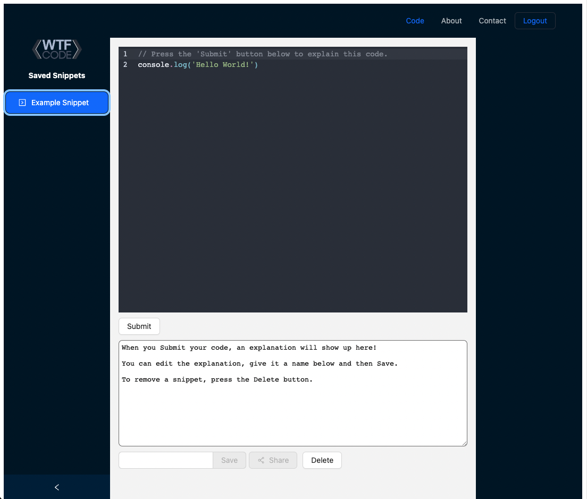

# WTFCode
<p />By Michael Martens and Jon Shogren

[](https://opensource.org/licenses/MIT)

## Description
This application utilized Google's OpenAI platform to take in a block of code and explain what its doing. The OpenAI platform, having scanned billions of lines of code, is capable of analyzing multiple languages, virtually any type of function / declaration / comment that you throw at it.

Visit the site here: https://www.wtf-code.com/


<br>

## Table of Contents
[Usage](#usage)<br />[Contributing](#contributing)<br />[Installation](#installation)<br />[License](#license)<br />[Questions](#questions)

## Usage
To use the site in Production, visit https://www.wtf-code.com/.

* If you're new to the app, you'll first need to Signup by clickingh on the Signup button.

* There, you'll be prompted to enter your name, email (this will be your username), and a password. Assuming all fields have been filled out and your username is not a duplicate, you will be signed in.

* Upon being signed in for the first time, we'll create an example snippet for you displayed on the left side of the screen under "Saved Snippets". Click on this, and your snippet will be loaded into the editor.

* To submit the snippet to OpenAI, click the Submit button below the editor. An API call is then made to OpenAI with some pre-configured settings and an explanation is rendered to the text area below the editor, which you can edit, name and save.
* To remove a snippet, select the Delete button.

## Contributing
To contribute, follow the Installation steps below. Because there are multiple sensitive API keys required to work with this app (specifically, for connecting to OpenAI and Mandrill and our MongoDB), you'll either need to reach out to us to coordinate sharing of these keys or you'll need to create accounts with [OpenAI](https://www.apoenai.com) and [Mandrill](https://www.mandrillapp.com)** as well as your own database.

** This also requires a [Mailchimp](https://www.mailchimp.com) account -- they have a free tier and the ability to create a free demo Mandrill account.

Once you have that setup, create a ```.env-cmdrc.json``` file in the root directory with the following credentials:

```
{
    "developement": {
        "REACT_APP_MONGODB_URI": "{Our MongoDB connection string}",
        "REACT_APP_OPENAI_API_KEY": "{OpenAI API Key}",
        "REACT_APP_MANDRILL": "{Mandrill API Key}"
    },
    "production": {
        "REACT_APP_MONGODB_URI": "{Our MongoDB connection string}",
        "REACT_APP_OPENAI_API_KEY": "{OpenAI API Key}",
        "REACT_APP_MANDRILL": "{Mandrill API Key}"
    }
}
```
Because we're using React Router and hosting the app on Heroku, there are a few specifications we have to make to our package.json Scripts. Here are the required scripts for Developement v. Production -- ```Note: the scripts that require updating are "dev", "build", and "start":

For ```Developement```:

```
"scripts": {
    "dev": "env-cmd -e developement vite",
    "build": "env-cmd -e production vite build",
    "preview": "vite preview",
    "start:dev": "concurrently \"npm run dev\" \"cd server && npm run start\" ",
    "start": "env-cmd -e production node server/server.js",
    "server": "cd server server.js --ignore client",
    "heroku-install": "cd server && npm i && cd ../client && npm i",
    "client": "cd client && npm start",
    "postinstall": "vite build"
  },
  ```

For ```Production```:

```
"scripts": {
    "dev": "vite",
    "build": "vite build",
    "preview": "vite preview",
    "start:dev": "concurrently \"npm run dev\" \"cd server && npm run start\" ",
    "start": "node server/server.js",
    "server": "cd server server.js --ignore client",
    "heroku-install": "cd server && npm i && cd ../client && npm i",
    "client": "cd client && npm start",
    "postinstall": "vite build"
  },
```

Lastly, in our ```app.jsx``` file, you'll need to toggle between routing GraphQL from local reference to Heroku reference:

```
const httpLink = createHttpLink({
  uri: 'http://localhost:3001/graphql', // This is for Developement
  // uri: '/graphql', // This is for Production when pushing to Heroku
});
```

## Installation
To install:

* Clone this repository and pull it down to your local machine
* ```npm install``` to install the following dependencies:
    *  ```@apollo/client``` for GraphQL
    *  ```@codemirror/lang-javascript``` for the Editor
    *  ```@mailchimp/mailchimp_transactional``` for Sharing snippets
    *  ```@uiw/codemirror-themes``` for Editor themes
    *  ```@uiw/react-codemirror``` for the Editor
    *  ```antd``` for Ant D CSS components
    *  ```apollo-server-express``` for handling our server
    *  ```bcrypt``` for authentication encryption
    *  ```concurrently``` to run multiple package.json scripts
    *  ```dotenv``` to handle environment variables
    *  ```env-cmd``` to handle environment variables (specific to React)
    *  ```express``` for handling our server
    *  ```jsonwebtoken``` for authentication
    *  ```jwt-decode``` for decoding authentication
    *  ```mongodb``` for our database
    *  ```mongoose``` for our database
    *  ```openai``` to work with OpenAI
    *  ```path``` for working with file directories
    *  ```react``` to handle React
    *  ```react-dom``` to handle React routing
    *  ```react-router``` to handle React routing
    *  ```react-router-dom``` to handle React routing
    *  ```@vitejs/plugin-react``` to handle Vite (instead of create-react-app)
    *  ```vite``` to handle Vite (instead of create-react-app)

## License
This project is licensed under the MIT license.

A short and simple permissive license with conditions only requiring preservation of copyright and license notices. Licensed works, modifications, and larger works may be distributed under different terms and without source code.<p />For more information visit https://choosealicense.com/licenses/mit/.

## Questions
Find us on Github at https://github.com/makeithappenmike and https://github.com/shogren<p/>You can reach us via email at hello@wtf-code.com if you have any questions.